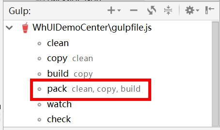

# 一、工程简介

## 目录结构

```text
WhUIDemoCenter					
|—assets	资源			
|	|_img	图片文件夹		
|		|—favicon.ico	浏览器小logo
|		|_logo.png	项目logo
|—lib	核心组件			
|	|—admin			
|	|—comm	项目公共文件夹		
|	|—jquery			
|	|—layui			
|	|—vue			
|	|_whui			
|		|—css		
|		|	|_whui.css	全局样式
|		|—js		
|		|	|_whui.js	全局方法
|		|_whconfig.js	核心配置文件
|—plugins	第三方插件			
|	|—compatible	浏览器兼容性插件		
|	|—modules		
|		|_dateformat 时间格式化插件
|		|_ztree 树插件
|	|—fontawesome	字体插件		
|	|_vconsole	vconsole		
|_views	项目页面			
	|_main	项目主模块		
		|—main-index		
		|	|_main-index.html	项目首页
		|—layout		
		|	|_layout.html	项目布局页
		|—start		
		|	|_start.html	项目入口页
		|_error		
			|—404.html	404错误页
			|_error.html	其他错误页

```

## 部分公共配置

* 详细配置见whconfig.js

```javascript
debug: runtime === 'D' || false, //是否开启调试模式。如开启，接口异常时会抛出异常 URL等信息
runtime: runtime,
name: 'WhUI DemoCenter', //系统名
describe: '物华前端PC框架，后台管理系统示例中心', //系统描述
pageTabs: true, //是否开启页面选项卡功能。单页面专业版不推荐开启
interceptor: true, //是否开启未登入拦截
req: {
	tokenName: 'access_token', //token字段名
	pageName: 'page', //当前第几页字段名
	limitName: 'limit', //每页笔数字段名
	timeout: 7000 //请求超时时间
},
resp: {
	codeName: 'code', //返回码字段名
	dataName: 'data', //返回数据字段名
	descName: 'desc', //返回描述字段名
	countName: 'count', //返回总笔数字段名
	code: {
		success: 200, //成功返回码
		logout: 4001 //token错误返回码
	}
},
```


# 二、命名规则

* <label style="color:red;">所有命名一律使用小写字母，多个单词以短杠-连接</label>


## 项目命名

* 以whxx开头，如：whxx-\** 或 whxx-\**-**

## 目录命名

* 一级目录以业务模块命名，如：menu
* 二级目录以具体业务操作命名，如：menu-add
* 二级目录主页以**-index命名，如：menu-index

## HTML命名

* 与二级目录名保持一致，如：menu-add.html

## less、css命名

* 与二级目录名保持一致，如：menu-add.less/menu-add.css

## js命名

* 与二级目录名保持一致，如：menu-add.js


# 三、HTML开发规范


## 标签书写

* 标签内id和class应写在最左边以增加代码可读性

``` html
<div id="menu-index" class="menu-index" ...>
...
</div>
```

## class、id命名

* 命名应尽量语义化，即可准确描述当前代码或操作的作用，如：query-bill(查询账单)
* 不以表现形式命名，如：~~query-button~~
* 避免创建无样式信息的 class

## html代码包裹

* <label style="color:red;">html代码段最外层必须以div包裹，其id(页面id)命名必须与html文件名一致</label>
* 第一行加上title标签，内容为页面中文名

``` html
<div id="menu-index">
	<title>菜单主页</title>
	...
</div>
```

## css、js引入位置
* 在页面代码段最上方引入css文件
* 在页面代码段最下方引入js文件

``` java
<link rel="stylesheet" type="text/css" href="../../menu/menu-index/menu-index.css"/>
<div id="menu-index">
...
</div>
<script src="../../menu/menu-index/menu-index.js" type="text/javascript" charset="utf-8"></script>
```


# 四、css开发规范

## 结构规范

* 为避免css污染，所有业务页面自由样式的最外层必须包含本页面的id

```css
#menu-index #query-bill{
	...
}
#menu-index .delete-bill{
	...
}
```

## 一般规范
* 主要样式应写有简单明了的注释以增加可读性
* 慎用!important进行样式覆盖

# 五、js开发规范

## 语法规范
* if、for等等条件语句必须使用大括号<label style="color:red;">{}</label>包裹
* 所有语句必须以分号收尾<label style="color:red;">;</label>(方法体除外)

## 字符串书写规范
* 为配合html代码书写，所有字符串以单引号<label style="color:red;">''</label>包裹，不再使用双引号

## 变量命名规范
* 所有变量命名应尽量语义化，如：userList(用户列表)
* 禁止以无意义字母或单词命名，如：~~a~~、~~hello~~

## 页面元素操作规范
* 所有使用jQuery或其它方式操作页面元素时必须携带本页面的id

```javascript
jQuery('#menu-index #query-bill').click(...);
```

## 一般规范
* 所有代码应当写在layui.use方法中

```javascript
layui.use(['admin', 'table', 'form', 'layer'], function() {
	...
});
```
* 主要业务方法、逻辑、变量必须写有注释以增加可读性

# 六、UI示例


## ajax请求

* 标准数据返回格式

```json
{
	"code":200,
	"desc":"成功描述",
	"data":{...}或[...]
}
```

* 公共请求方法
* 如对失败回调和配置参数没有特殊要求，则只用传入前3个参数
* 返回码为200时，成功回调提供两个返回参数，data为返回的业务数据(json格式)，desc为返回的成功描述

```javascript
/**
 * AJAX请求
 * @param {String} reqUrl 请求地址
 * @param {Object} reqParams 请求参数
 * @param {Function} doSuccess 成功回调
 * @param {Function} doFail 失败回调
 * @param {Object} options 配置参数
 * @param {Object} options.headers 请求头
 * @param {String} options.contentType 内容类型，默认application/x-www-form-urlencoded
 * @param {String} options.type 请求方式，默认POST
 * @param {String} options.dataType 响应数据格式，默认json
 * @param {Boolean} options.normal 是否常规模式(自动解析返回码200)，默认true
 * @param {Boolean} options.showloading 是否显示加载圈，默认true
 * @param {Number} options.timeout 超时时间，默认7000
 */

var params = {
	"a":1,
	"b":"2"
};
layui.whui.request(whconfig.bizurl.demo.query, params, function(data,desc){
	//TODO data即为返回的业务数据，desc为返回的成功描述
});
```

## 查询表单


```html
<div class="layui-row whui-form">
	<div class="layui-col-md12">
		<form class="layui-form" lay-filter="menu-query-form">
			<div class="layui-row">
				<div class="layui-col-xs12 layui-col-sm6 layui-col-md3">
					<div class="layui-form-item">
						<label class="layui-form-label">姓名</label>
						<div class="layui-input-block">
							<input type="text" name="userName" lay-verify="required" autocomplete="off" placeholder="请输入标题" class="layui-input">
						</div>
					</div>
				</div>
				<div class="layui-col-xs12 layui-col-sm6 layui-col-md3">
					<div class="layui-form-item">
						<label class="layui-form-label">这里五个字</label>
						<div class="layui-input-block">
							<input type="text" name="password" lay-verify="title" autocomplete="off" placeholder="请输入标题" class="layui-input">
						</div>
					</div>
				</div>
				<div class="layui-col-xs12 layui-col-sm6 layui-col-md3">
					<div class="layui-form-item">
						<label class="layui-form-label">手机号</label>
						<div class="layui-input-block">
							<input type="text" name="phone" lay-verify="title" autocomplete="off" placeholder="请输入手机号" class="layui-input">
						</div>
					</div>
				</div>
				<div class="layui-col-xs12 layui-col-sm6 layui-col-md3">
					<div class="layui-form-item whui-form-item-querymore">
						<div class="whui-btn-querymore">更多查询</div>
					</div>
				</div>
			</div>
			<div class="layui-row whui-form-area-querymore">
				<div class="layui-col-xs12 layui-col-sm6 layui-col-md3">
					<div class="layui-form-item">
						<label class="layui-form-label">单行框</label>
						<div class="layui-input-block">
							<input type="text" name="sex" lay-verify="title" autocomplete="off" placeholder="请输入标题" class="layui-input">
						</div>
					</div>
				</div>
				<div class="layui-col-xs12 layui-col-sm6 layui-col-md3">
					<div class="layui-form-item">
						<label class="layui-form-label">单行框</label>
						<div class="layui-input-block">
							<input type="text" name="birthday" lay-verify="title" autocomplete="off" placeholder="请输入标题" class="layui-input">
						</div>
					</div>
				</div>
				<div class="layui-col-xs12 layui-col-sm6 layui-col-md3">
					<div class="layui-form-item">
						<label class="layui-form-label">单行框</label>
						<div class="layui-input-block">
							<input type="text" name="address" lay-verify="title" autocomplete="off" placeholder="请输入标题" class="layui-input">
						</div>
					</div>
				</div>
				<div class="layui-col-xs12 layui-col-sm6 layui-col-md3">
					<div class="layui-form-item">
						<label class="layui-form-label">单行框</label>
						<div class="layui-input-block">
							<input type="text" name="title" lay-verify="title" autocomplete="off" placeholder="请输入标题" class="layui-input">
						</div>
					</div>
				</div>
			</div>
			<button class="layui-btn layui-hide" lay-submit lay-filter="menu-query-btn"></button>
		</form>
	</div>
</div>
```

* 最外层包裹whui-form
* 更多查询
* 表单验证 lay-verify
* 必填项*号
* 查询

```javascript
/**
 * 查询
 */
jQuery('#menu-index .whui-btn-query').click(function() {
	form.on('submit(menu-query-btn)', function(data) {
		query(table, data.field);
		return false; //阻止表单跳转。如果需要表单跳转，去掉这段即可。
	});
	jQuery('button[lay-filter="menu-query-btn"]').click();
});
```
* 重置

```javascript
/**
 * 重置
 */
jQuery('#menu-index .whui-btn-reset').click(function() {
	form.val('menu-query-form', {
		'userName': '方天涯',
		'sex': '女',
		'auth': 3,
		'check[write]': true,
		'open': false,
		'desc': '描述'
	});
});
```

## 功能条


```html
<div class="layui-row whui-btnbar">
	<div class="layui-col-md12">
		<div class="layui-row">
			<div class="layui-col-xs12 layui-col-sm8 layui-col-md9">
				<div class="layui-btn-container">
					<div class="layui-btn-group">
						<button class="layui-btn whui-btn-add"><i class="fa fa-plus"></i>新增</button>
						<button class="layui-btn whui-btn-update"><i class="fa fa-pencil"></i>修改</button>
						<button class="layui-btn whui-btn-delete"><i class="fa fa-trash-alt"></i>删除</button>
						<button class="layui-btn whui-btn-upload"><i class="fa fa-upload"></i>上传</button>
						<button class="layui-btn whui-btn-download"><i class="fa fa-download"></i>下载</button>
						<button class="layui-btn whui-btn-print"><i class="fa fa-print"></i>打印</button>
						<button class="layui-btn whui-btn-print"><i class="fa fa-folder-open"></i>打开</button>
						<button class="layui-btn"><i class="fa fa-cog"></i>操作</button>
					</div>
				</div>
			</div>
			<div class="layui-col-xs12 layui-col-sm4 layui-col-md3" style="text-align: center;">
				<div class="layui-btn-container">
					<div class="layui-btn-group">
						<button class="layui-btn whui-btn-query"><i class="fa fa-search"></i>查询</button>
						<button class="layui-btn whui-btn-reset"><i class="fa fa-eraser"></i>重置</button>
					</div>
				</div>
			</div>
		</div>
	</div>
</div>
```

* 最外层包裹whui-btnbar
* 常用按钮图标：新增、修改、删除、上传、下载、打印、打开、操作、查询、重置


## 表格


* 隐藏列，传入cols时不设置该列，取出数据是仍可取到该列的数据

```html
<div class="layui-row layui-col-space15">
	<div class="layui-col-md12">
		<div class="layui-card">
			<div class="layui-card-body">
				<table class="layui-hide" id="menu-table"></table>
			</div>
		</div>
	</div>
</div>
```

# 七、插件

## whui

* 加载方法

```javascript
layui.use(['whui'], function() {
	var whui = layui.whui;
});
```

* 常用API

```javascript
/**
 * 成功提示
 * @param {String} msg 消息
 * @param {Function} callback 回调
 * @param {Number} time 自动关闭所需毫秒
 */
whui.msg.success(msg,callback,time);

/**
 * 失败提示
 * @param {String} msg 消息
 * @param {Function} callback 回调
 * @param {Number} time 自动关闭所需毫秒
 */
 whui.msg.failed(msg,callback,time);

 /**
 * 警告提示
 * @param {String} msg 消息
 * @param {Function} callback 回调
 * @param {Number} time 自动关闭所需毫秒
 */
whui.msg.warn(msg,callback,time);

```


## 公共插件 whcomm

* 加载方法

```javascript
layui.use(['whcomm'], function() {
	var whcomm = layui.whcomm;
});
```

* 常用API

```javascript
/**
 * 更多查询效果
 * @param {String} eleId 页面ID
 */
whcomm.ui.form.querymore(eleId);

/**
 * 必填*效果
 * @param {String} eleId 页面ID
 */
whcomm.ui.form.verifyRequired(eleId);

```


## 日期时间格式化插件 dateformat

* 加载方法

```javascript
layui.use(['dateformat'], function() {
	var dateformat = layui.dateformat;
});
```

* 常用API

```javascript
/**
 * 格式化时间
 * @param {Date} date
 * @param {String} fmt(例：yyyy-MM-dd hh:mm:ss)
 */
dateformat.format(date, fmt);

```

## 树插件 zTree

* 加载方法

```javascript
layui.use(['zTree'], function() {
	var zTree = layui.zTree;
});
```

* 常用API

参考zTree官网api

# 打包

* 1.安装node.js
* 2.安卓cnpm
* 3.webstorm命名窗口执行cnpm install


* 4.刷新gulp命令窗口
* 5.执行pack任务



* 6.任务执行完成后，在dist文件夹中输出，注意whconfig中的runtime
